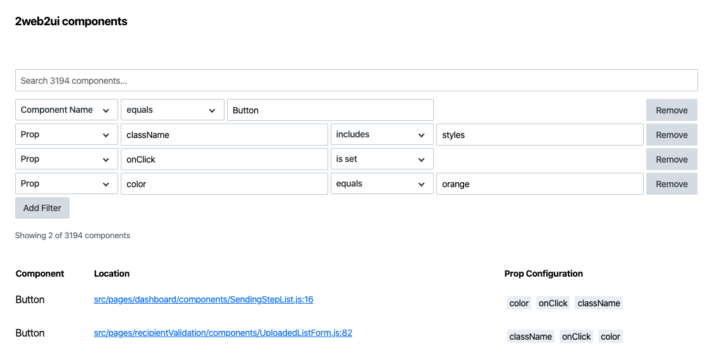

## Propspotter

Discover how your app's components are used. 



---

#### Getting Started

Install propspotter:
```bash
npm i propspotter@alpha
```

Create a config file in your app:
```js
// propspotter.config.js
module.exports = {
  include: "/src/**/*.js",
  port: 9000,
  openBrowser: true
}
```

Modify your npm package:
```js
// package.json
"scripts": {
  "propspotter:start": "propspotter start"
}
```
